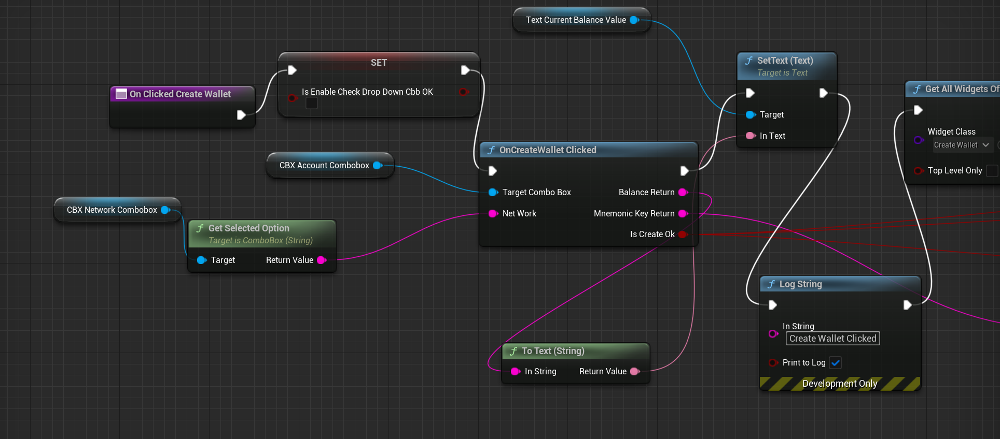
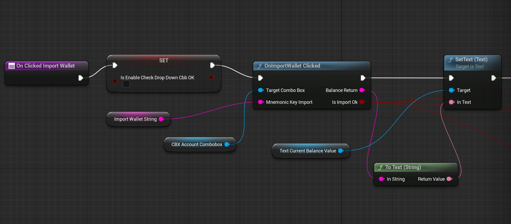
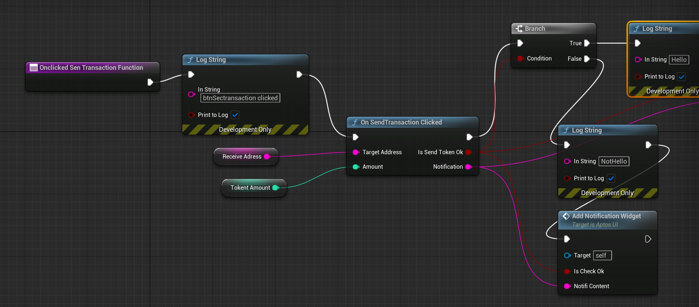
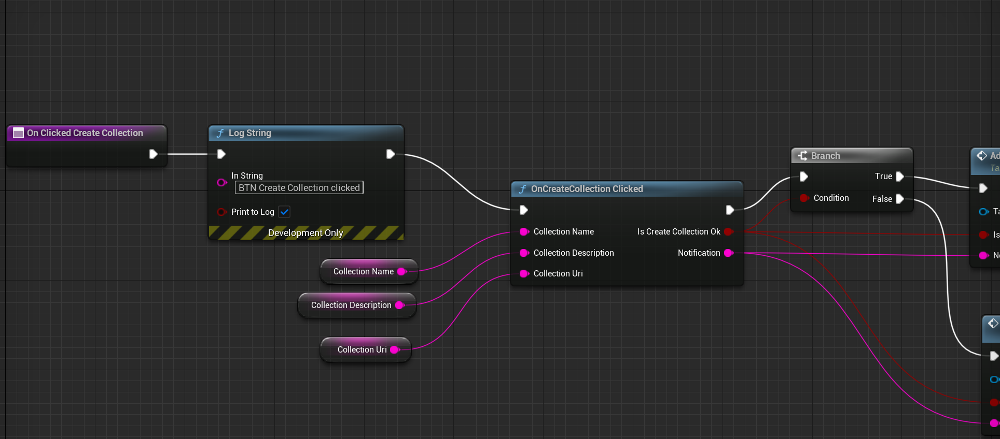
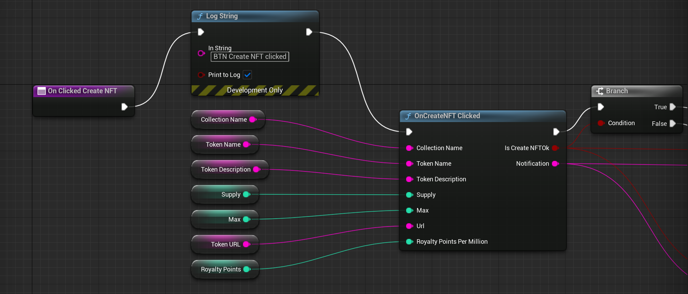
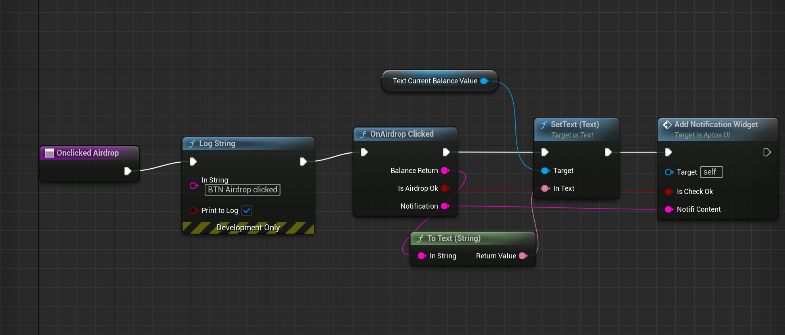

<p align="center">
	
</p>


# Aptos-Cpp-SDK #

Aptos-Cpp-SDK is a cpp package written in C++ to help developers integrate Aptos blockchain technology into their cpp and Unreal projects.

- [Project Layout](#project-layout)
- [Features](#features)
- [Requirements](#requirements)
- [Dependencies](#dependencies)
- [Installation](#installation)
- [Example Unreal Project](#example-unreal-project)
- [Using Aptos-Cpp-SDK](#using-aptos-cpp-sdk)
  - [RestClient](#restclient)
  - [FaucetClient](#faucetclient)
  - [TokenClient](#tokenclient)
  - [EntryFunction](#entryfunction)
  - [Wallet](#wallet)
- [Using Aptos-Cpp-SDK with Blueprint](#using-aptos-cpp-sdk-with-blueprint)
- [Examples](#examples)
- [License](#license)

### Project Layout ###  

1. **`AptosSDKDemo/`**:: This directory contains examples showcasing how to use the Aptos Cpp SDK.
2. **`AptosUI/`**:: This directory contains Wallet example Unreal Project using Aptos Cpp SDK.
3. **`Doc/`**:: Documentation related to the project, which include setup API, Class references.
4. **`Resource/`**:: A place for various resources needed for the project, like images, data files, or other assets.
5. **`Src/`**: Contains the main source code for the SDK. This is where you'll find the core functionality, client classes, and utility modules.
6. **`ThirdParty/`**: Holds unit tests and integration tests for verifying the correctness of your code. Writing comprehensive tests ensures robustness.

### Features ###

- [x] Generate new wallets.
- [x] Create new accounts using the ED25519 Key Standard.
- [x] Simulate and submit transaction.
- [x] Create new collections.
- [x] Create new tokens.
- [x] Check account information (Token and APT balances, submitted contracts, etc).
- [x] Import previously used wallets using BIP-39 and BIP-32 Mnemonic seeds or an ED25519 private key.
- [x] Create arbitrary tokens.
- [x] Compatibility with main, dev, and test networks.
- [x] Comprehensive Unit and Integration Test coverage.

### Requirements ###

| Platforms                              | Unreal Version | Installation           | Status       |
| -------------------------------------- | ------------- | ---------------------- | ------------ |
| Mac / Linux                            | Unity engine 5.3| 3rd lib build config| Fully Tested |


### Dependencies
- https://github.com/edwardstock/bip3x
- https://github.com/edwardstock/toolbox
- https://github.com/weidai11/cryptopp
- https://github.com/microsoft/cpprestsdk

### Installation ###
#Update submodule
```
git submodule update --init --recursive
```

#Install package management
```
brew install conan
```

#For setup project env
```
conan install . -s compiler.cppstd=20 --build=missing
```

#For build project
```
mkdir build
cd build
cmake ..
```
Note: For MacOS maybe have error when not found path 'macos'. To fix that update file conan_toolchain.cmake like below:
```
set(CMAKE_OSX_SYSROOT /Applications/Xcode.app/Contents/Developer/Platforms/MacOSX.platform/Developer/SDKs/MacOSX.sdk CACHE STRING "" FORCE)
```

#For run code coverage on MacOS
First of all, make sure you have llvm and lcov installed. You can install them using brew:
brew install llvm lcov
To generate coverage data, you would then do:
cmake -DCODE_COVERAGE=ON ..
make
make coverage

### Example Unreal Project
A examples unreal project can be found in the following directory:  
`AptosUI/`.

The SDK's test suite can be found in the following directory:   
`Test/`.   

The test suite covers:
- Account - private / public keys, signatures and verification
- Transactions - creation and serialization
- BCS serialization and deserialization

### Using Aptos-Cpp-SDK
Aptos-Cpp-SDK can integrate into your own any cpp or Unreal projects. The main functionality comes from several key classes: `RestClient`, `FacetClient`, `TokenClient`, `EntryFunction`, `Account`, and `Wallet`.

For Unreal project please reference example in ```AptosUI```, you need define Build.cs to integration Aptos library with Unreal engine.
Here is an example:
```cshape
using UnrealBuildTool;
using System.IO;

public class AptosUI : ModuleRules
{
	public AptosUI(ReadOnlyTargetRules Target) : base(Target)
	{
		PCHUsage = PCHUsageMode.UseExplicitOrSharedPCHs;
		bEnableExceptions = true;
		PublicDependencyModuleNames.AddRange(new string[] { "Core", "CoreUObject", "Engine", "InputCore", "UMG" });
		PrivateDependencyModuleNames.AddRange(new string[] { "Slate", "SlateCore" });
		PrivateDependencyModuleNames.AddRange(new string[] { });
		if (Target.Platform == UnrealTargetPlatform.Mac)
        {
			string AptosUiLogicPath = Path.Combine(ModuleDirectory, "../../../build/", "libAptosUILogic.dylib");
			string AptosLibPath = Path.Combine(ModuleDirectory, "../../../build/", "libAptos.dylib");
			string Bip3xLibPath = Path.Combine(ModuleDirectory, "../../../Plugins/lib/", "libbip3x.dylib");
			string destinationDirectory = Target.ProjectFile.Directory.FullName;
			File.Copy(AptosUiLogicPath, Path.Combine(destinationDirectory, "libAptosUILogic.dylib"), true);
			File.Copy(AptosLibPath, Path.Combine(destinationDirectory, "libAptos.dylib"), true);
			File.Copy(Bip3xLibPath, Path.Combine(destinationDirectory, "libbip3x.dylib"), true);

			PublicIncludePaths.AddRange(new string[] { Path.Combine(ModuleDirectory, "../../../") });
			PublicAdditionalLibraries.Add(Path.Combine(destinationDirectory, "libAptos.dylib"));
			PublicAdditionalLibraries.Add(Path.Combine(destinationDirectory, "libAptosUILogic.dylib"));
			PublicAdditionalLibraries.Add(Path.Combine(destinationDirectory, "libbip3x.dylib"));
        }

		PublicIncludePaths.AddRange(new string[] { "/usr/local/include/" });
		bEnableUndefinedIdentifierWarnings = false;
		CppStandard = CppStandardVersion.Cpp17;
	}
}
```

There are three core client classes:
- **FaucetClient** - used to request for airdrops
- **RESTClient** - used to query the aptos blockchain

Let's go over each of the classes, along with examples for each to demonstrate their power and flexibility.
#### RestClient ####
The REST Client provides you with the fundamental transaction endpoints needed for interacting with the Aptos Blockchain. The following showcases how to initialize the `RestClient` and `AptosTokenClient`.
```cpp
RestClient restClient;
restClient.SetEndpoint(Constants::DEVNET_BASE_URL);
```
As shown before, it only take a few lines of code to initialize a transfer for Aptos coins. This is the main class developers will be leveraging to interact directly with the Aptos Blockchain via REST Client calls.
```cpp
AptosRESTModel::Transaction createCollectionTxn;
AptosRESTModel::ResponseInfo responseInfo;
m_restClient.CreateCollection([&](AptosRESTModel::Transaction _createCollectionTxn, AptosRESTModel::ResponseInfo _responseInfo)
                              {
                                  createCollectionTxn = _createCollectionTxn;
                                  responseInfo = _responseInfo; },
                              wallet->Account(),
                              _collectionName, _collectionDescription, _collectionUri);
bool success = false;
if (responseInfo.status == AptosRESTModel::ResponseInfo::Status::Success)
{
    success = true;
}
else
{
    success = false;
}
```

#### FaucetClient ####
The Faucet Client allows the developer to leverage the ability to fund wallets on any of the non-main networks within the Aptos Blockchain. This can easily speed up development times through automating the process of funding wallets. Here's an example on how to use the Faucet Client:
```cpp
std::string faucetEndpoint = "https://faucet.devnet.aptoslabs.com";
Aptos::Rest::FaucetClient::FundAccount([amount](bool success, AptosRESTModel::ResponseInfo)
                                       {
                                           if (success) {
                                               std::cout << "Successfully Get Airdrop of " << (float)amount << " APT" << std::endl;
                                           } else {
                                               std::cout << "airdrop failed" << std::endl;
                                           } },
                                       wallet->Account().getAccountAddress()->ToString(),
                                       amount,
                                       faucetEndpoint);
```

#### TokenClient ####
#### EntryFunction ####
If a developer needs more flexibility with how they want to shape their transactions, e.g., arbitrary, generic, custom, using EntryFunction is the key class, along with the usage of the REST Client, to submit those types of transactions that aren't defined already. This is how the developer would initialize the transaction arguments, create the EntryFunction payload, and submit the transaction using BCS:
```cpp
std::vector<std::shared_ptr<ISerializable>> transactionArguments;
transactionArguments.push_back(std::make_shared<AccountAddress>(Recipient));
transactionArguments.push_back(std::make_shared<U64>(Amount));
EntryFunction payload = EntryFunction::Natural(
    ModuleId(AccountAddress::FromHex("0x1"), "aptos_account"),
    "transfer",
    TagSequence({}),
    Sequence(transactionArguments));
std::shared_ptr<SignedTransaction> signedTransaction = nullptr;
CreateBCSSignedTransaction([&signedTransaction](std::shared_ptr<SignedTransaction> _signedTransaction)
                           { signedTransaction = _signedTransaction; },
                           Sender, TransactionPayload(std::make_shared<EntryFunction>(payload)));
AptosRESTModel::ResponseInfo responseInfo;
std::string submitBcsTxnJsonResponse = "";
SubmitBCSTransaction([&responseInfo, &submitBcsTxnJsonResponse](std::string _responseJson,
                                                                AptosRESTModel::ResponseInfo _responseInfo)
                     {
submitBcsTxnJsonResponse = _responseJson;
responseInfo = _responseInfo; },
                     *signedTransaction);
```

#### Wallet ####
Wallets will be the primary method of accessing accounts on the Aptos Blockchain via Mnemonic Keys, since they'll allow you to generate multiple accounts with ease. Here's an example on how to initialize a wallet using a mnemonic key:
```cpp
// Initializing Wallet.
std::string mnemo = "stadium valid laundry unknown tuition train december camera fiber vault sniff ripple";
Wallet* wallet = new Wallet(mnemo);

// Initialize A Random Wallet.
bip3x::bip3x_mnemonic::mnemonic_result mnemonic = bip3x::bip3x_mnemonic::generate();
Wallet* wallet = new Wallet(mnemonic.raw);
```
This provides the developer with what's known as an [HD Wallet](https://www.investopedia.com/terms/h/hd-wallet-hierarchical-deterministic-wallet.asp) (Hierarchical Deterministic Wallet), which is what will enable to generate as many private keys from the wallet as they want. Here's different ways on how to retrieve the account(s) from the Wallet, along with deriving the mnemonic seed from the Wallet; which is the seed that's derived from the input mnemonic phrase and is what allows the developer to generate a number accounts from the Wallet:

```cpp
// Get the Initial Main Account.
auto mainAccount = wallet->Account();

// Get Any Other Accounts Created / Derived From the Wallet (i represents the index from 0).
auto account = wallet->GetDerivedAccount(i);

// Derive Mnemonic Seed from Wallet.
auto seed = wallet->DeriveMnemonicSeed();
```

The Wallet object can also allow the main account to sign and verify data, as shown here:

```cpp
// Initialize a Signature Object.
static const std::vector<uint8_t> MessageUt8Bytes = {
    87, 69, 76, 67, 79, 77, 69, 32,
    84, 79, 32, 65, 80, 84, 79, 83, 33 };
auto acct = wallet->Account();
Signature signature = acct.Sign(Utils::ByteVectorToSecBlock(MessageUt8Bytes));

// Initialize a Boolean Verified.
bool verified = acct.Verify(MessageUt8Bytes, signature);
```
### Using Aptos-Cpp-SDK with Blueprint
**Create Wallet**


**Import Wallet**


**Send Transaction**


**Create Collection**


**Create NFT**


**Airdrop**


### Examples ###

The SDK comes with several examples that show how to leverage the SDK to its full potential. The examples include `AptosToken`, `Multisig`, `SimulateTransferCoin`, `TransferCoin`, and `SimpleNftExample`.


https://github.com/VAR-META-Tech/Aptos-Cpp-SDK/assets/59425826/1ec2cded-a68d-4fe6-ad9c-0ba48e2f636e


### License ###
This project is licensed under the Apache-2.0 License. Refer to the LICENSE.txt file for details.
